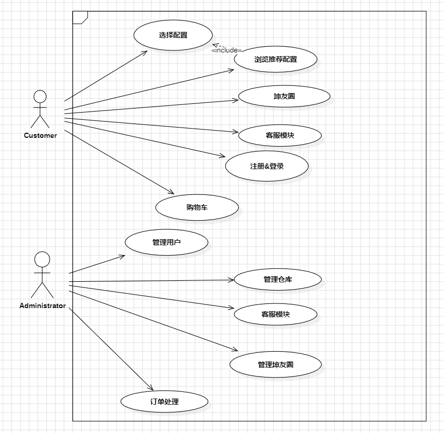
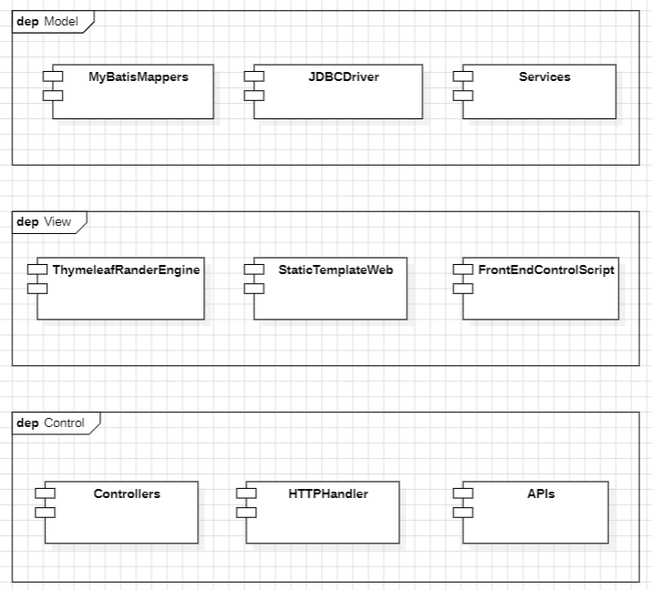
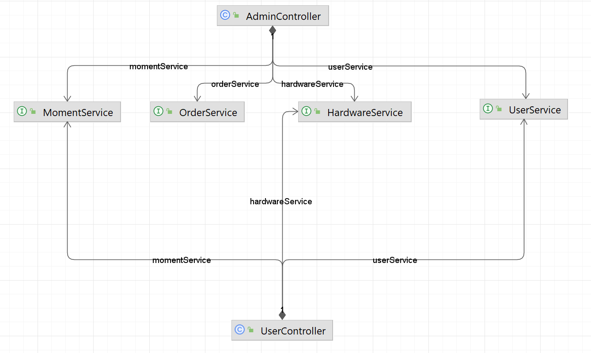
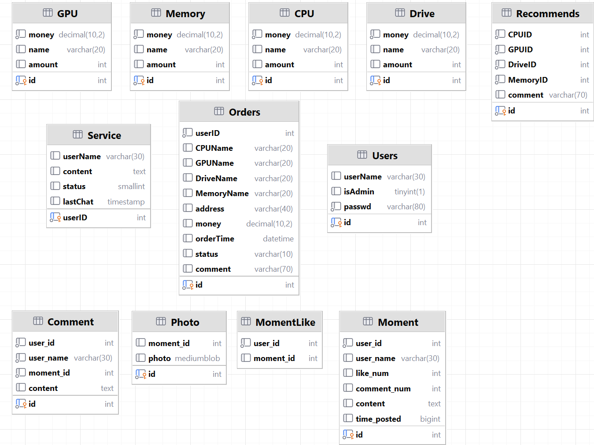

# 爱坤电脑城项目报告

## 项目概述

+ 项目名称：爱坤电脑城

+ 项目描述：一个为所有人提供优质电脑售卖服务的网站

+ 项目目标：成为世界上最好的电脑销售网站

+ **项目分工：**
    + 项目经理：孙潇桐
    + UI开发工程师：纪国梁
    + 后端开发工程师：俞家宝、施宇杰
    + 测试工程师：任庆华
    + 文档负责人：楼康

## 需求分析

+ 功能需求：

    + 用户端：注册、登录、浏览商品、定制电脑、加入购物车、结算购物车、查看订单、在线支付、**坤友圈**、客服沟通功能等。
    + 管理员端：用户管理（密码和权限控制）、仓库管理（CPU、GPU、RAM、硬盘）、坤友圈管理、订单处理、客服回复

+ 非功能需求：响应速度快、界面友好、安全性高、可扩展性好。

+ 经过需求分析得到的用例图：

    

## 系统设计

- 系统架构：采用MVC（Model-View-Controller）架构，前端采用`HTML, CSS, JavaScript ` 实现，后端采用 `Java` 语言的 `spring boot` 搭建。

    

- 系统模块：分为两个大的模块：

    - 用户模块：坤友圈、定制机型模块、客服模块、登录注册模块

    - 管理员模块：用户管理模块、商品管理模块、订单管理模块、坤友圈管理模块

        将上面的模块整合进了四个service类中：

        

- 数据库设计：使用关系型数据库，设计用户表、商品表、订单表等，并建立各表之间的关联关系。下面是ER图。

    

## 系统实现

- 使用的技术：前端使用HTML/CSS/JavaScript传统三大件，使用了bootstrap 5的样式美化网页，使用jQuery简化前端代码。后端使用基于Java的spring boot框架，同时使用`thymeleaf`来从模板构建网页，将前后端的逻辑分离。
- 编程语言：HTML、CSS、JavaScript、Java。
- 开发环境：`JetBrain intelliJ IDEA Ultimate`、`DBeaver`、`Chrome v121`。

## 系统测试

- 测试用例：编写各功能模块的测试用例，包括正常情况下的操作流程以及异常情况下的处理。
- 测试方法：采用黑盒测试和白盒测试相结合的方式，进行功能测试、性能测试、安全性测试等。

### 登录注册功能测试

| 注册     | C1       | C2                 | C3                 | C4                |
| -------- | -------- | ------------------ | ------------------ | ----------------- |
| 用户账号 | 不为空   | 空                 | 不为空             | 已存在            |
| 密码     | 不为空   | --                 | 空                 | 空                |
| 效果     | 成功注册 | 失败：请填写此字段 | 失败：请填写此字段 | 失败:用户名不合法 |

| 登录     | C1       | C2                      | C3                      | C4                | C5                 |
| -------- | -------- | ----------------------- | ----------------------- | ----------------- | ------------------ |
| 用户账号 | 正确     | --                      | 错误                    | 空                | 不为空             |
| 密码     | 正确     | 错误                    | --                      | --                | 空                 |
| 效果     | 成功登录 | 失败:用户名或密码不正确 | 失败:用户名或密码不正确 | 失败:请填写此字段 | 失败：请填写此字段 |

### 用户端功能测试

#### 浏览商品功能测试

**成功登陆后可以正常访问页面，并进行商品的浏览**

#### 加入购物车功能测试

**选择推荐配置定制**：成功将推荐配置中的商品加入购物车

**自定义配置定制**：点击对应的商品后，成功加入购物车

#### 购物车结算功能测试

**选择购入后，进入结账页面**

| 自选配置定制 | C1                  | C2                  | C3                  | C4                  | C5               |
| ------------ | ------------------- | ------------------- | ------------------- | ------------------- | ---------------- |
| CPU          | 未选择              | --                  | --                  | --                  |                  |
| 显卡         | --                  | 未选择              | --                  | --                  | 已选择           |
| 内存         | --                  | --                  | 未选择              | --                  | 已选择           |
| 硬盘         | --                  | --                  | --                  | 未选择              | 已选择           |
| 效果         | 提示:请选择所有部件 | 提示:请选择所有部件 | 提示:请选择所有部件 | 提示:请选择所有部件 | 成功进入结账页面 |

#### 在线支付功能测试

| 在线支付 | C1    | C2     | C3       |
| -------- | ----- | ------ | -------- |
| 地址     | 空    | 不为空 | 不为空   |
| 支付方式 | --    | 空     | 不为空   |
| 备注     | --    | --     | --       |
| 效果     | 提示: | 提示:  | 成功支付 |

#### 查看订单功能测试

**未支付任何订单**：订单详情页面为空

**已经支付任意订单**：显示所有订单信息（订单商品详情、订单状态、订单支付时间、订单总支付金额）

#### 客服沟通功能测试

**点击发送按钮**：成功发送消息并在聊天框内显示(用户名：聊天内容)

**点击刷新**：刷新客服消息，更新聊天框内容

#### 坤友圈功能测试

①进入坤友圈页面后可以查看kun友的帖子（用户名、帖子信息、点赞按钮、评论按钮）

②**点赞按钮**：未点赞则成功点赞，已点赞则取消点赞

③**评论按钮**：点击后成功查看该帖子的评论内容；输入信息发表评论后成功发表

④**发帖**：

* 输入内容后成果发帖
* 上传图片后成功发帖

### 管理端功能测试

#### 用户管理功能测试

①**成功显示所有用户信息**：用户ID、用户名、用户权限

②**改变用户权限**：成功在`Admin`和`User`之间转换

③**更改密码**：成功修改用户的密码

#### 仓库管理功能测试

①**成功显示仓库所有商品信息**：商品名称、价格、剩余数量

②**编辑商品**：成功对商品的价格和剩余量进行更新

③**删除商品**：成功删除该类商品

| 添加商品 | C1   | C2   | C3   | C4     | C5     | C6       |
| -------- | ---- | ---- | ---- | ------ | ------ | -------- |
| 名称     | 空   | --   | --   | --     | --     | 合法     |
| 价格     | --   | 空   | --   | 不合法 | --     | 合法     |
| 剩余量   | --   | --   | 空   | --     | 不合法 | 合法     |
| 效果     | 失败 | 失败 | 失败 | 失败   | 失败   | 添加成功 |

#### 坤友圈管理功能测试

点击帖子删除按钮，成功删除Kun友的帖子

#### 订单处理功能测试

①**成功显示所有订单详情**：订单商品详情、订单状态、订单支付时间、订单总支付金额

②**修改订单状态**：成功将订单状态修改为`未发货`、`已发货`或`已完成`

#### 客服回复功能测试

①**显示消息列表信息**：客户名称、消息状态、最新消息时间

②**消息状态**：完成操作后，成功更改为三个状态中对应的状态（`客服未读`、`用户未读`、`均已读`）

③**回复**：成功进入聊天框页面

* **点击发送按钮**：成功发送消息并在聊天框内显示(客服：聊天内容)
* **点击刷新**：刷新消息，更新聊天框内容

## 总结与展望

一、推荐配置一直接点击定制，加入购物车之后，直接点击购入会提示:请选择所有部件。其他的推荐配置没有问题

二、订单结算页面，当收货地址、支付方式任意为空，仍可以完成支付功能

三、客服沟通与回复，点击发送后，并没有更新数据库内容，双方都看不到刚刚发送的内容

四、坤友圈评论什么都没有输入的时候，仍旧可以发送评论

五、坤友圈发帖可以为空发帖

六、仓库管理中编辑或添加商品的时候，在价格或者剩余量为负的情况下依旧操作成功

七、在聊天框时，点击右上角的叉叉，无法返回“客服回复”的消息列表页面
