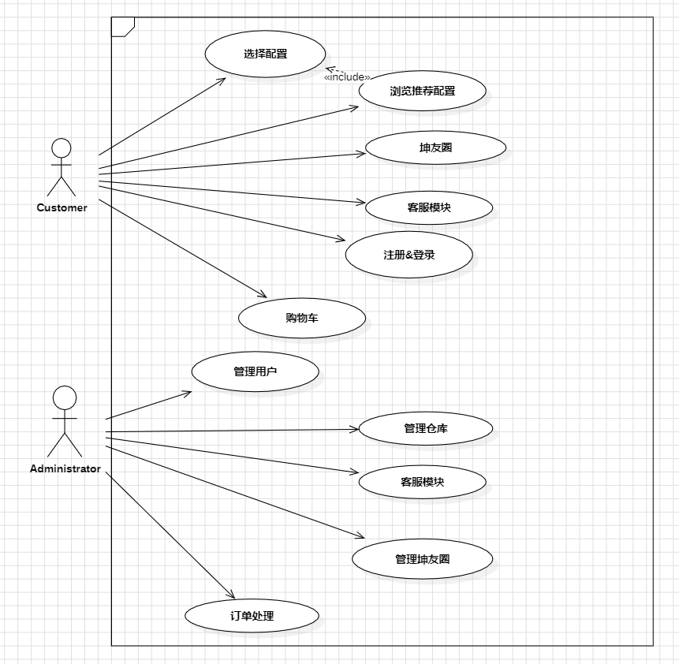
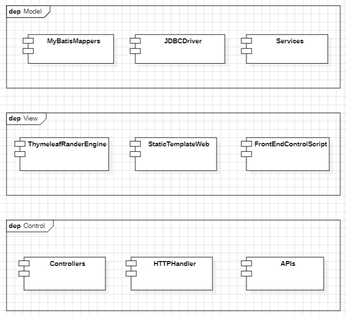
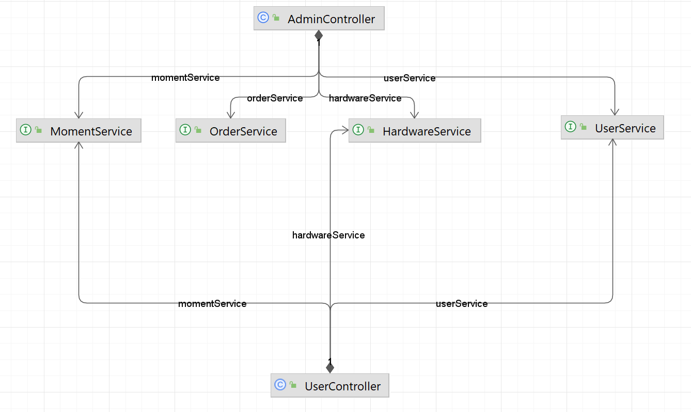
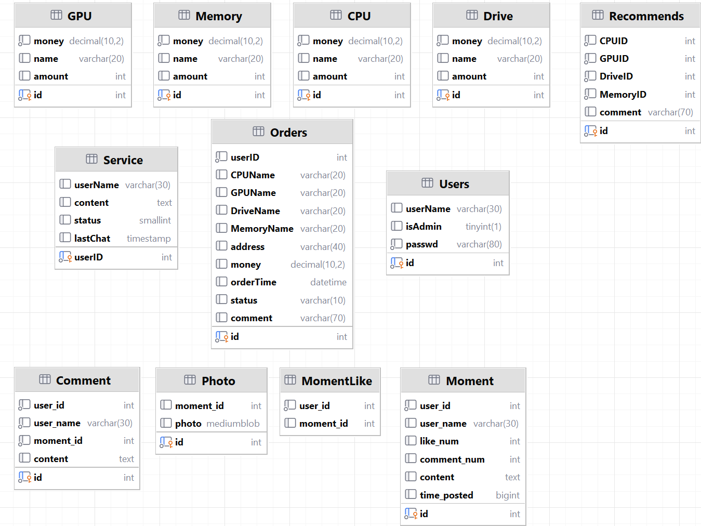

# 爱坤电脑城项目报告

## 项目概述

+ 项目名称：爱坤电脑城

+ 项目描述：一个为所有人提供优质电脑售卖服务的网站!

+ 项目目标：成为世界上最好的电脑销售网站

+ **项目分工：**
    + 项目经理：孙潇桐
    + UI开发工程师：纪国梁
    + 后端开发工程师：俞家宝、施宇杰
    + 测试工程师：任庆华
    + 文档负责人：楼康

## 需求分析

+ 功能需求：

    + 用户端：注册、登录、浏览商品、定制电脑、加入购物车、结算购物车、查看订单、在线支付、**坤友圈**、客服沟通功能等。
    + 管理员端：用户管理（密码和权限控制）、仓库管理（CPU、GPU、RAM、硬盘）、坤友圈管理、订单处理、客服回复、推荐配置管理

+ 非功能需求：响应速度快、界面友好、安全性高、可扩展性好。

+ 经过需求分析得到的用例图：

    

## 系统设计

- 系统架构：采用MVC（Model-View-Controller）架构，前端采用`HTML, CSS, JavaScript ` 实现，后端采用 `Java` 语言的 `spring boot` 搭建。

    

- 系统模块：分为两个大的模块：

    - 用户模块：坤友圈、定制机型模块、客服模块、登录注册模块

    - 管理员模块：用户管理模块、商品管理模块、订单管理模块、坤友圈管理模块、推荐配置管理模块

        将上面的模块整合进了四个service类中：

        

- 数据库设计：使用关系型数据库，设计用户表、商品表、订单表等，并建立各表之间的关联关系。下面是ER图。

    

## 系统实现

- 使用的技术：前端使用HTML/CSS/JavaScript传统三大件，使用了bootstrap 5的样式美化网页，使用jQuery简化前端代码。后端使用基于Java的spring boot框架，同时使用`thymeleaf`来从模板构建网页，将前后端的逻辑分离。
- 编程语言：HTML、CSS、JavaScript、Java。
- 开发环境：`JetBrain intelliJ IDEA Ultimate`、`DBeaver`、`Chrome v121`。


### 配置SpringSecurity安全过滤器

```java
import ...

@Configuration
@EnableWebSecurity
public class SecurityConfig {
    final UserDetailsServiceImpl userDetailsService;

    @Bean
    public PasswordEncoder passwordEncoder() {
        return new BCryptPasswordEncoder();
    }

    public SecurityConfig(UserDetailsServiceImpl serDetailsService) {
        this.userDetailsService = userDetailsService;
    }

    @Bean
    public SecurityFilterChain securityFilterChain(HttpSecurity httpSecurity) throws Exception {
        httpSecurity.csrf(AbstractHttpConfigurer::disable)
                .authorizeHttpRequests(auth -> auth
                        .requestMatchers("/Admin/**").hasRole("admin")
                        .requestMatchers(HttpMethod.OPTIONS).permitAll()
                        .requestMatchers("/", "/Home*").permitAll()
                        .requestMatchers("/Login*").permitAll()
                        .requestMatchers("/Register*").permitAll()
                        .requestMatchers("/static/**").permitAll()
                        .requestMatchers("/favicon.ico").permitAll()
                        .anyRequest().authenticated()
                ).formLogin(formLogin -> formLogin
                        .loginProcessingUrl("/login")
                        .loginPage("/Login")
                        .permitAll()
                        .usernameParameter("username")
                        .passwordParameter("password")
                        .successHandler((request, response, authentication) ->
                                response.sendRedirect("/"))
                        .failureHandler((request, response, authentication) ->
                                response.sendRedirect("/Login?error"))
                ).logout(LogoutConfigurer::permitAll)
                .userDetailsService(userDetailsService);
        return httpSecurity.build();
    }
}
```

### 用户功能Mapper映射文件

```xml
<?xml version="1.0" encoding="UTF-8"?>
<!DOCTYPE mapper PUBLIC "-//mybatis.org//DTD Mapper 3.0//EN" "http://mybatis.org/dtd/mybatis-3-mapper.dtd">
<mapper namespace="com.suxton.kunmall.dao.UserMapper">
  <resultMap id="BaseResultMap" type="com.suxton.kunmall.pojo.User">
    <id column="id" jdbcType="INTEGER" property="id" />
    <result column="userName" jdbcType="VARCHAR" property="username" />
    <result column="isAdmin" jdbcType="BIT" property="isadmin" />
    <result column="passwd" jdbcType="VARCHAR" property="passwd" />
  </resultMap>
  <sql id="Example_Where_Clause">    
    <where>
      <foreach collection="oredCriteria" item="criteria" separator="or">
        <if test="criteria.valid">
          <trim prefix="(" prefixOverrides="and" suffix=")">
            <foreach collection="criteria.criteria" item="criterion">
              <choose>
                <when test="criterion.noValue">
                  and ${criterion.condition}
                </when>
                <when test="criterion.singleValue">
                  and ${criterion.condition} #{criterion.value}
                </when>
                <when test="criterion.betweenValue">
                  and ${criterion.condition} #{criterion.value} and #{criterion.secondValue}
                </when>
                <when test="criterion.listValue">
                  and ${criterion.condition}
                  <foreach close=")" collection="criterion.value" item="listItem" open="(" separator=",">
                    #{listItem}
                  </foreach>
                </when>
              </choose>
            </foreach>
          </trim>
        </if>
      </foreach>
    </where>
  </sql>
  <sql id="Update_By_Example_Where_Clause">
    <where>
      <foreach collection="example.oredCriteria" item="criteria" separator="or">
        <if test="criteria.valid">
          <trim prefix="(" prefixOverrides="and" suffix=")">
            <foreach collection="criteria.criteria" item="criterion">
              <choose>
                <when test="criterion.noValue">
                  and ${criterion.condition}
                </when>
                <when test="criterion.singleValue">
                  and ${criterion.condition} #{criterion.value}
                </when>
                <when test="criterion.betweenValue">
                  and ${criterion.condition} #{criterion.value} and #{criterion.secondValue}
                </when>
                <when test="criterion.listValue">
                  and ${criterion.condition}
                  <foreach close=")" collection="criterion.value" item="listItem" open="(" separator=",">
                    #{listItem}
                  </foreach>
                </when>
              </choose>
            </foreach>
          </trim>
        </if>
      </foreach>
    </where>
  </sql>
  <sql id="Base_Column_List">
    id, userName, isAdmin, passwd
  </sql>
  <select id="selectByExample" parameterType="com.suxton.kunmall.pojo.UserExample" resultMap="BaseResultMap">
    select
    <if test="distinct">
      distinct
    </if>
    <include refid="Base_Column_List" />
    from Users
    <if test="_parameter != null">
      <include refid="Example_Where_Clause" />
    </if>
    <if test="orderByClause != null">
      order by ${orderByClause}
    </if>
  </select>
  <select id="selectByPrimaryKey" parameterType="java.lang.Integer" resultMap="BaseResultMap">
    select 
    <include refid="Base_Column_List" />
    from Users
    where id = #{id,jdbcType=INTEGER}
  </select>
  <delete id="deleteByPrimaryKey" parameterType="java.lang.Integer">
    delete from Users
    where id = #{id,jdbcType=INTEGER}
  </delete>
  <delete id="deleteByExample" parameterType="com.suxton.kunmall.pojo.UserExample">
    delete from Users
    <if test="_parameter != null">
      <include refid="Example_Where_Clause" />
    </if>
  </delete>
  <insert id="insert" parameterType="com.suxton.kunmall.pojo.User">
    insert into Users (id, userName, isAdmin, 
      passwd)
    values (#{id,jdbcType=INTEGER}, #{username,jdbcType=VARCHAR}, #{isadmin,jdbcType=BIT}, 
      #{passwd,jdbcType=VARCHAR})
  </insert>
  <insert id="insertSelective" parameterType="com.suxton.kunmall.pojo.User">
    insert into Users
    <trim prefix="(" suffix=")" suffixOverrides=",">
      <if test="id != null">
        id,
      </if>
      <if test="username != null">
        userName,
      </if>
      <if test="isadmin != null">
        isAdmin,
      </if>
      <if test="passwd != null">
        passwd,
      </if>
    </trim>
    <trim prefix="values (" suffix=")" suffixOverrides=",">
      <if test="id != null">
        #{id,jdbcType=INTEGER},
      </if>
      <if test="username != null">
        #{username,jdbcType=VARCHAR},
      </if>
      <if test="isadmin != null">
        #{isadmin,jdbcType=BIT},
      </if>
      <if test="passwd != null">
        #{passwd,jdbcType=VARCHAR},
      </if>
    </trim>
  </insert>
  <select id="countByExample" parameterType="com.suxton.kunmall.pojo.UserExample" resultType="java.lang.Long">
    select count(*) from Users
    <if test="_parameter != null">
      <include refid="Example_Where_Clause" />
    </if>
  </select>
  <update id="updateByExampleSelective" parameterType="map">
    update Users
    <set>
      <if test="row.id != null">
        id = #{row.id,jdbcType=INTEGER},
      </if>
      <if test="row.username != null">
        userName = #{row.username,jdbcType=VARCHAR},
      </if>
      <if test="row.isadmin != null">
        isAdmin = #{row.isadmin,jdbcType=BIT},
      </if>
      <if test="row.passwd != null">
        passwd = #{row.passwd,jdbcType=VARCHAR},
      </if>
    </set>
    <if test="example != null">
      <include refid="Update_By_Example_Where_Clause" />
    </if>
  </update>
  <update id="updateByExample" parameterType="map">
    update Users
    set id = #{row.id,jdbcType=INTEGER},
      userName = #{row.username,jdbcType=VARCHAR},
      isAdmin = #{row.isadmin,jdbcType=BIT},
      passwd = #{row.passwd,jdbcType=VARCHAR}
    <if test="example != null">
      <include refid="Update_By_Example_Where_Clause" />
    </if>
  </update>
  <update id="updateByPrimaryKeySelective" parameterType="com.suxton.kunmall.pojo.User">
    update Users
    <set>
      <if test="username != null">
        userName = #{username,jdbcType=VARCHAR},
      </if>
      <if test="isadmin != null">
        isAdmin = #{isadmin,jdbcType=BIT},
      </if>
      <if test="passwd != null">
        passwd = #{passwd,jdbcType=VARCHAR},
      </if>
    </set>
    where id = #{id,jdbcType=INTEGER}
  </update>
  <update id="updateByPrimaryKey" parameterType="com.suxton.kunmall.pojo.User">
    update Users
    set userName = #{username,jdbcType=VARCHAR},
      isAdmin = #{isadmin,jdbcType=BIT},
      passwd = #{passwd,jdbcType=VARCHAR}
    where id = #{id,jdbcType=INTEGER}
  </update>
</mapper>
```

### 响应商品显示功能请求JAVA代码

```java
import ...

@Controller
public class UserController {
    private final UserService userService;
    private final HardwareService hardwareService;
    private final MomentService momentService;

    private void userInfoSetter(Model model) {
        Authentication authentication = SecurityContextHolder.getContext().getAuthentication();
        Object principal = authentication.getPrincipal();
        if (!(principal instanceof String)) {
            MyUserDetails userDetails = (MyUserDetails) principal;
            String username = userDetails.getUsername();
            model.addAttribute("username", username);
            if (userDetails.isAdmin()) {
                model.addAttribute("admin", true);
            } else model.addAttribute("admin", false);
            model.addAttribute("unread", userService.isUnread(userDetails.id()));
        }

    }

    @Autowired
    public UserController(UserService userService, HardwareService hardwareService
            , MomentService momentService) {
        this.userService = userService;
        this.hardwareService = hardwareService;
        this.momentService = momentService;
    }
    
    @GetMapping("/Customize*")
    public String customize(@RequestParam(defaultValue = "0", value = "recommend") int num, Model model) {
        userInfoSetter(model);
        List<String[]> cpuInfoList = hardwareService.getCPUInfoList();
        model.addAttribute("CPUList", cpuInfoList);
        List<String[]> gpuInfoList = hardwareService.getGPUInfoList();
        model.addAttribute("GPUList", gpuInfoList);
        List<String[]> memoryInfoList = hardwareService.getMemoryInfoList();
        model.addAttribute("MemoryList", memoryInfoList);
        List<String[]> driveInfoList = hardwareService.getDriveInfoList();
        model.addAttribute("DriveList", driveInfoList);
        HashMap<String, Integer> details;
        if (0 != num) {
            details = hardwareService.getRecommendDetail(num);
        } else details = new HashMap<>();
        model.addAttribute("details", details);
        return "user/Customize";
    }
}
```


### Kun友圈发帖JS代码

```javascript
let moment_idx = -1;
let moment_del = -1
Dropzone.options.myDropzone = {
    maxFiles: 9, // 最大上传文件数量
    maxFilesize: 5,
    addRemoveLinks: true,
    acceptedFiles: ".jpg,.jpeg",
    dictRemoveFile: "删除",
    dictDefaultMessage: "拖放图片到这里或点击上传",
    thumbnailWidth: 120,
    thumbnailHeight: 120,
    parallelUploads: 9,
    autoProcessQueue: false,
    params: {id: moment_idx},

    dictMaxFilesExceeded: "最多只能上传" + 9 + "个文件！",
    dictResponseError: '文件上传失败!',
    dictInvalidFileType: "文件类型只能是*.jpg,*.gif,*.png,*.jpeg",
    dictFallbackMessage: "浏览器不受支持",
    dictFileTooBig: "文件过大上传文件最大支持.",
    dictRemoveLinks: "删除",
    dictCancelUpload: "取消",
    init: function () {
        let submitButton = document.querySelector("#submit-button");
        let that = this;
        submitButton.addEventListener("click", function () {
            $.post("/UploadKunMomentMetaData", {
                text: $('#postText').val()
            }, function (data) {
                console.log(data)
                moment_idx = data
            }).done(
                function () {
                    that.options.params = {"id": moment_idx};
                    that.processQueue();
                    setTimeout(function () {
                        location.reload();
                    }, 300);
                }
            )
        });
    }
};

function toggle_text(id) {
    let div_id = "#momentText" + id;
    let btn_id = "#toggleButton" + id;
    let contentDiv = $(div_id);
    let toggleButton = $(btn_id);
    let object_height = parseFloat(contentDiv.css("line-height")) * 3
    let currentMaxHeight = parseFloat(contentDiv.css("max-height").replace("px", ""));
    
    if (currentMaxHeight <= object_height) {
        contentDiv.stop().animate({'max-height': '100em'}, {
            duration: 800,
            complete: function () {
                toggleButton.text('收起');
            }
        });
    } else {
        contentDiv.stop().animate({'max-height': object_height + 'px'}, {
            duration: 800,
            complete: function () {
                toggleButton.text('展开');
            }
        });
    }
}


function judge(id) {
    let div_id = "#momentText" + id;
    let btn_id = "#toggleButton" + id;
    let contentDiv = $(div_id);
    let toggleButton = $(btn_id);
    let object_height = parseFloat(contentDiv.css("line-height")) * 3
    let line_height = contentDiv.outerHeight();
    contentDiv.css("max-height", object_height + "px")
    if (line_height <= object_height) toggleButton.hide();
}

function comment(id) {
    let text_id = "#commentInput" + id;
    let text_area = $(text_id)
    let text = text_area.val();
    $.post("addComment", {moment_id: id, content: text}, function (result) {
        console.log(result);
    })
    text_area.val("");
    setTimeout(function () {
        refresh(id);
    }, 300);
    let comment_num = $('#commentNun' + id);
    let num = parseInt(comment_num.text());
    comment_num.text(num + 1);
}

function toggle_comment(id) {
    let btn_id = '#commentToggleBtn' + id;
    let toggle_btn = $(btn_id);
    let status = toggle_btn.attr('aria-expanded') === 'true';
    if (status) {
        refresh(id)
    }
}

function refresh(id) {
    let comment_area_div = $('#comments' + id);
    $.getJSON("/getComments", {moment_id: id}, function (data) {
        comment_area_div.empty();
        $.each(data, function (index, comment) {
            let commentHtml = '<div class="card card-body comment"><span class="comment-user-name">' +
                comment.userName + '</span>' + comment.content + '</div>';
            comment_area_div.append(commentHtml);
        });
    })
}

function like(id) {
    let like_num_text = $('#likeNum' + id);
    let like_num = parseInt(like_num_text.text());
    console.log(like_num)
    $.post("/likeMoment", {moment_id: id}, function (data) {
        console.log(data)
        if (data === 1) {
            like_num++
            like_num_text.text(like_num)
            showLikeToast('点赞成功');
        } else {
            like_num--
            like_num_text.text(like_num)
            showLikeToast('已赞过，现取消点赞')
        }
    });
}

function showLikeToast(message) {
    // 创建一个toast元素
    let likeStatusToast = $('#likeStatusToast');
    let toastBody = likeStatusToast.find('.toast-body');

    // 设置toast的文字
    toastBody.text(message);
    likeStatusToast.removeClass('toast-fade-out');
    // 添加动画类，实现淡入效果
    likeStatusToast.addClass('toast-fade-in');

    // 显示toast
    likeStatusToast.toast('show');

    setTimeout(function () {
        likeStatusToast.removeClass('toast-fade-in').addClass('toast-fade-out');
    }, 300);

    // 隐藏toast后移除动画类
    likeStatusToast.on('hidden.bs.toast', function () {
        likeStatusToast.removeClass('toast-fade-out');
    });

}

function queryRemove(id) {
    moment_del = id
    $('#confirmationModal').modal('show');
}


function removeMomentSel() {
    if (moment_del === -1) {
        return
    }
    $.post("/Admin/RemoveMoment", {moment_id: moment_del}, function (data) {
        if (data === 'ok') {
            $('#confirmationModal').modal('hide');
            showLikeToast("已删除")
            let id = 'moment' + moment_del.toString();
            console.log(id);
            $('#' + id).remove();
        } else {
            showLikeToast("删除失败")
        }
        moment_del = -1
    });

}
```


## 系统测试

- 测试用例：编写各功能模块的测试用例，包括正常情况下的操作流程以及异常情况下的处理。
- 测试方法：采用黑盒测试和白盒测试相结合的方式，进行功能测试、性能测试、安全性测试等。

### 登录注册功能测试

| 注册     | C1       | C2                 | C3                 | C4                |
| -------- | -------- | ------------------ | ------------------ | ----------------- |
| 用户账号 | 不为空   | 空                 | 不为空             | 已存在            |
| 密码     | 不为空   | --                 | 空                 | 空                |
| 期望效果 | 成功注册 | 失败：请填写此字段 | 失败：请填写此字段 | 失败:用户名不合法 |

| 登录     | C1       | C2                      | C3                      | C4                | C5                 |
| -------- | -------- | ----------------------- | ----------------------- | ----------------- | ------------------ |
| 用户账号 | 正确     | --                      | 错误                    | 空                | 不为空             |
| 密码     | 正确     | 错误                    | --                      | --                | 空                 |
| 期望效果 | 成功登录 | 失败:用户名或密码不正确 | 失败:用户名或密码不正确 | 失败:请填写此字段 | 失败：请填写此字段 |

### 用户端功能测试

#### 浏览商品功能测试

**成功登陆后可以正常访问页面，并进行商品的浏览**

#### 加入购物车功能测试

**选择推荐配置定制**：成功将推荐配置中的商品加入购物车

**自定义配置定制**：点击对应的商品后，成功加入购物车

#### 购物车结算功能测试

**选择购入后，进入结账页面**

| 自选配置定制 | C1                  | C2                  | C3                  | C4                  | C5               |
| ------------ | ------------------- | ------------------- | ------------------- | ------------------- | ---------------- |
| CPU          | 未选择              | --                  | --                  | --                  |                  |
| 显卡         | --                  | 未选择              | --                  | --                  | 已选择           |
| 内存         | --                  | --                  | 未选择              | --                  | 已选择           |
| 硬盘         | --                  | --                  | --                  | 未选择              | 已选择           |
| 期望效果     | 提示:请选择所有部件 | 提示:请选择所有部件 | 提示:请选择所有部件 | 提示:请选择所有部件 | 成功进入结账页面 |

#### 在线支付功能测试

填写收获地址和选择支付方式之后成功完成支付

#### 查看订单功能测试

**未支付任何订单**：订单详情页面为空

**已经支付任意订单**：显示所有订单信息（订单商品详情、订单状态、订单支付时间、订单总支付金额）

#### 客服沟通功能测试

**点击发送按钮**：成功发送消息并在聊天框内显示(用户名：聊天内容)

**点击刷新**：刷新客服消息，更新聊天框内容

#### 坤友圈功能测试

①进入坤友圈页面后可以查看kun友的帖子（用户名、帖子信息、点赞按钮、评论按钮）

②**点赞按钮**：未点赞则成功点赞，已点赞则取消点赞

③**评论按钮**：点击后成功查看该帖子的评论内容；输入信息发表评论后成功发表

④**发帖**：

* 输入内容后成果发帖
* 上传图片后成功发帖

### 管理端功能测试

#### 用户管理功能测试

①**成功显示所有用户信息**：用户ID、用户名、用户权限

②**改变用户权限**：成功在`Admin`和`User`之间转换

③**更改密码**：成功修改用户的密码

#### 仓库管理功能测试

①**成功显示仓库所有商品信息**：商品名称、价格、剩余数量

②**编辑商品**：成功对商品的价格和剩余量进行更新

③**删除商品**：成功删除该类商品

| 添加商品 | C1   | C2   | C3   | C4     | C5     | C6       |
| -------- | ---- | ---- | ---- | ------ | ------ | -------- |
| 名称     | 空   | --   | --   | --     | --     | 合法     |
| 价格     | --   | 空   | --   | 不合法 | --     | 合法     |
| 剩余量   | --   | --   | 空   | --     | 不合法 | 合法     |
| 期望效果 | 失败 | 失败 | 失败 | 失败   | 失败   | 添加成功 |

#### 坤友圈管理功能测试

点击帖子删除按钮，成功删除Kun友的帖子

#### 订单处理功能测试

①**成功显示所有订单详情**：订单商品详情、订单状态、订单支付时间、订单总支付金额

②**修改订单状态**：成功将订单状态修改为`未发货`、`已发货`或`已完成`

#### 客服回复功能测试

①**显示消息列表信息**：客户名称、消息状态、最新消息时间

②**消息状态**：完成操作后，成功更改为三个状态中对应的状态（`客服未读`、`用户未读`、`均已读`）

③**回复**：成功进入聊天框页面

* **点击发送按钮**：成功发送消息并在聊天框内显示(客服：聊天内容)
* **点击刷新**：刷新消息，更新聊天框内容

#### 推荐配置管理功能测试

①**显示推荐配置信息**：配置列表、价格、对推荐配置的描述

②**编辑修改推荐配置**：进行增删改

* 点击编辑按钮：可以成功修改推荐配置的信息
* 点击删除按钮：可以删除推荐配置
* 点击右下角蓝色加号按钮：可以增加推荐配置

## 总结与展望

 爱坤电脑城项目经过需求分析、系统设计、系统实现和系统测试等多个阶段的努力，已经成功地实现了一个提供电脑销售服务的网站。在项目概述中，明确了项目名称、描述和目标，并指定了项目成员及其职责。在需求分析中，详细列出了用户端和管理员端的功能需求，并设计了相应的用例图。在系统设计中，选择了MVC架构，设计了系统的模块和数据库，并提供了相应的ER图。在系统实现中，采用了前端和后端技术，开发了用户端和管理员端的功能。在系统测试中，编写了各功能模块的测试用例，并进行了黑盒测试和白盒测试。

尽管爱坤电脑城项目已经取得了一定的成果，但仍然有一些方面可以改进和扩展。首先，可以进一步优化用户界面，提升用户体验。其次，可以加强系统的安全性，防止恶意攻击和信息泄露。另外，可以考虑引入更多的营销策略，吸引更多的用户，提升网站的知名度和影响力。同时，可以持续跟踪用户的反馈意见，及时调整和优化系统功能，满足用户的需求。总的来说，爱坤电脑城项目在未来还有很大的发展空间和潜力，需要团队持续努力和创新。
