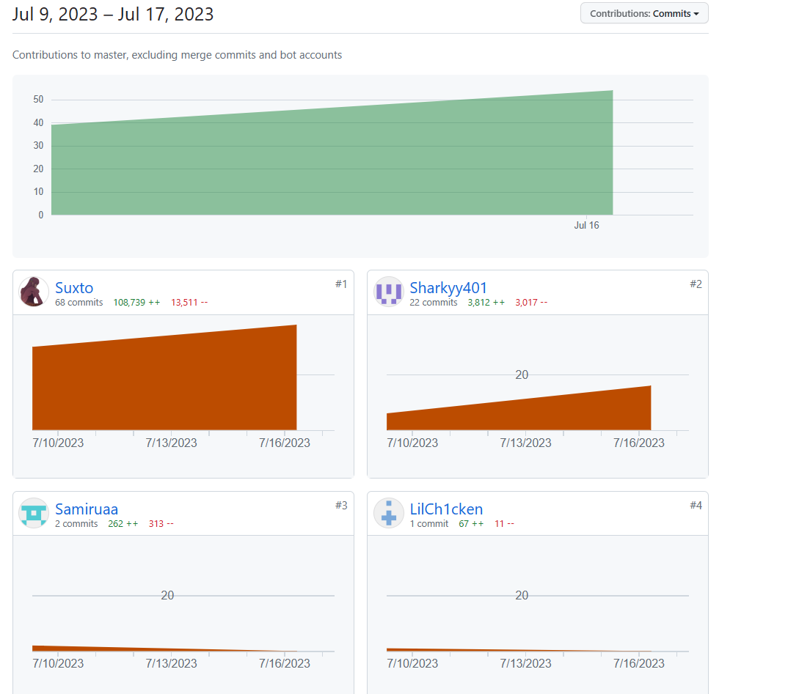

# 工作统计

代码提交统计

+ 孙潇桐 40%
    + 系统设计，数据库设计，全部后端代码，部分前端代码，接口设计，接口实现，前后端连接，单元测试，集成测试
+ 俞家宝 30%
    + 数据库设计，全部用户界面前端代码，部分管理员界面前端代码，单元测试，集成测试
+ 楼康 15%
    + 部分管理员界面前端代码，集成测试
+ 纪国梁 7%
    + 网页美化，集成测试
+ 任庆华 6%
    + 网页美化，集成测试
+ 施宇杰 1%
    + 集成测试
+ 梧桐 1%
    + 集成测试